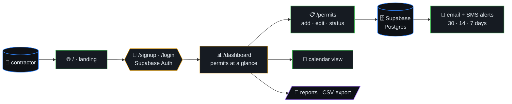
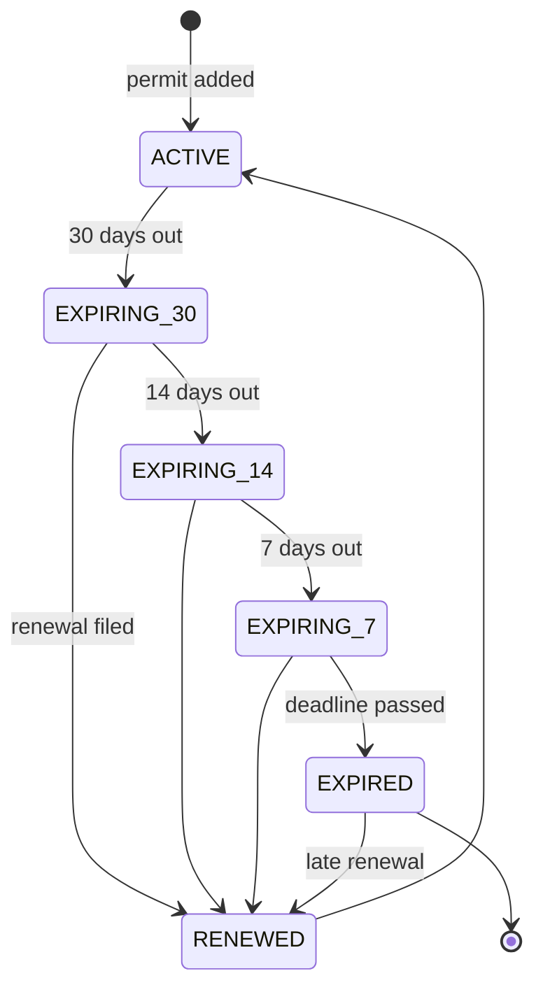
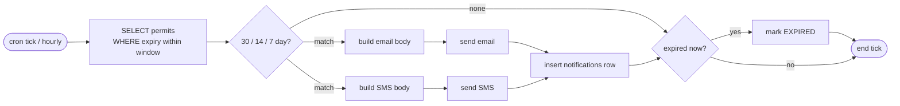

# Permit Tracker

> SaaS for contractors who track permits across multiple jurisdictions.
> Color-coded dashboard, calendar view, smart 30/14/7-day expiration
> alerts, and audit-ready compliance reports — so you never pay another
> $4,200 expired-permit fine.



## Table of contents

- [Stack](#stack)
- [Architecture](#architecture)
- [Permit lifecycle (state)](#permit-lifecycle-state)
- [Notification scheduler (algorithm)](#notification-scheduler-algorithm)
- [Getting Started](#getting-started)

## Permit lifecycle (state)



## Notification scheduler (algorithm)



## Stack

- Next.js 16 + React 19 + Tailwind CSS 4
- Supabase (auth + database)
- Vercel deployment
- TypeScript strict mode

## Architecture

- `/` — Landing page
- `/signup`, `/login` — Auth flows (Supabase)
- `/dashboard` — Color-coded permit dashboard
- `/permits` — Permit list + create/edit
- API routes under `/src/app/api/` for notifications + exports

## Getting Started

```bash
npm install
npm run dev
```

Open [http://localhost:3000](http://localhost:3000).
